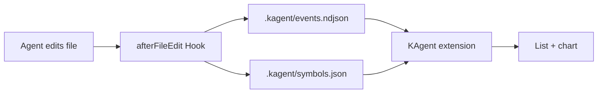

# KAgent

[中文](README.md) · [English](README.en.md)

**Turn every Cursor Agent file edit into a stock-style candlestick chart**  
One file = one ticker · First edit = IPO · Each edit round = one candle

> The workspace must be **Trusted** for hooks to collect data.

---

## Get started in three steps

### ① Install the extension

Pick one method:

#### Install from Open VSX

Use the [Open VSX extension page](https://open-vsx.org/extension/JStone/kagent), or:

```bash
codium --install-extension JStone.kagent
# Some environments:
code --install-extension JStone.kagent
```

#### Install from VSIX

1. Download `kagent-x.y.z.vsix` from [GitHub Releases](https://github.com/JStone2934/KAgent/releases), or [build from source](#package-from-source).
2. Install using any of:

| Method | Steps |
|--------|--------|
| **CLI (recommended)** | `cursor --install-extension "/path/to/kagent-0.1.3.vsix"` |
| **Command Palette** | `Ctrl+Shift+P` → **Extensions: Install from VSIX...** → pick `.vsix` |
| **Drag & drop** | Drop `.vsix` onto the **Extensions** view (may not work over Remote-SSH) |

**Reload the window** after install. If `cursor` is not found, run **Install 'cursor' command in PATH** from the palette and restart the terminal.

#### Package from source

```powershell
cd extension
npm install
npm run compile
npm run package
```

Output: `extension/kagent-x.y.z.vsix`.

**Windows:** `npm install` fails with `cp` not found

`postinstall` uses `cp`, which may fail on Windows. Copy the chart bundle manually, then compile/package:

```powershell
Copy-Item -Force node_modules\lightweight-charts\dist\lightweight-charts.standalone.production.js media\lightweight-charts.js
```

**Extension development**

Open the `extension` folder in Cursor / VS Code → **F5** (Run Extension) → in the Extension Development Host, open the **repository root** (not only the `extension` subfolder).

---

### ② Install project hooks

1. Open the **repository root** in Cursor
2. `Ctrl+Shift+P` → **`KAgent: 安装项目 Hooks`**

You should then have:

```
.cursor/hooks.json
.cursor/hooks/kagent-capture.mjs
.kagent/                 # runtime data; installer tries to add to .gitignore
```

This repo already includes sample hooks — **clone and skip** if you only use KAgent here. Run the command again on a new machine or in another project.

---

### ③ View the market

| Entry | Description |
|-------|-------------|
| **KAgent** activity bar icon | Sidebar **whole-repo market** |
| `KAgent: 打开行情图` | Same view |
| `KAgent: 刷新行情` | Refresh from the view title bar |

- **Left list**: each file touched by the Agent = one ticker; **▲/▼** = move vs. the previous candle
- **Right chart**: candles for the selected file; click a row to open the file in the editor
- **Top-right**: **CN / US** color scheme and **light / dark** tone (`kagent.colorScheme`, `kagent.colorTone`)

Each newly edited file appears as a newly “listed” ticker.

---

## What is it?

| Real world | KAgent |
|------------|--------|
| A stock | **One file** in the workspace |
| IPO | Agent’s **first** edit to that file |
| One candle | **One round** of edits (OHLC by line count + volume) |
| Red / green | **Line count** up or down (CN: red up; US: green up — switchable) |

**Features**

- **Capture**: [Cursor Hooks](https://cursor.com/docs/hooks) `afterFileEdit` → `.kagent/`
- **Sidebar market**: list + candles + volume; **offline** bundled chart, no network required
- **Fine-grained candles**: mixed delete/add in one round splits into two candles; same line count with rewritten content is tracked (semantic volatility)

---

## 30-second local demo

No Agent required — simulate edits:

```bash
node scripts/simulate-edit.mjs demo/sample.txt 3
node scripts/simulate-edit.mjs demo/sample.txt 1
```

Open the KAgent sidebar and select `demo/sample.txt`. Full walkthrough: [demo/watch-me.md](demo/watch-me.md).

---

## FAQ

| Issue | Fix |
|-------|-----|
| Can’t find KAgent in Cursor | Cursor doesn’t use Open VSX — use [VSIX](#install-from-vsix) or [Releases](https://github.com/JStone2934/KAgent/releases) |
| No “Install from VSIX” in Extensions UI | Use the **command palette** or **`cursor --install-extension`** |
| Sidebar always empty | Install **hooks**, set workspace **Trusted**, ensure the Agent **edited files** (or run the demo script) |
| Hooks never fire | Open the **repo root**; verify `.cursor/hooks.json` exists |
| `cursor` command not found | Install shell command to PATH from Cursor, restart terminal |

---

## Architecture & data



| Path | Role |
|------|------|
| `.kagent/events.ndjson` | One event per edit (NDJSON) |
| `.kagent/symbols.json` | “Listed” files |
| `.kagent/config.json` | Ignore paths (e.g. `node_modules`) |

**Candle fields (advanced)**

| Field | Meaning |
|-------|---------|
| Open / Close | **Line count** at start / end of the candle |
| High / Low | Max / min line count in the round |
| Volume | Lines removed or added |
| Split round | Delete-then-add in one edit → two candles |
| Color | Close ≥ open = bullish; CN red bullish, US green bullish |

---

## For developers

### Local build

```bash
cd extension
npm install && npm run compile   # dev: npm run watch
npm run package                  # → kagent-x.y.z.vsix
```

| Asset | Path |
|-------|------|
| UI preview | [docs/images/preview-sidebar.png](docs/images/preview-sidebar.png) |
| Concept art | [docs/images/concept.png](docs/images/concept.png) |
| Demo walkthrough | [demo/watch-me.md](demo/watch-me.md) |

### Release (maintainers)

| Workflow | Purpose |
|----------|---------|
| [CI](.github/workflows/ci.yml) | On `main` / PR changes under `extension/`: compile and package VSIX (uploaded as Artifact) |
| [Release](.github/workflows/release.yml) | Manual release: bump version → Open VSX → push tag → [GitHub Release](https://github.com/JStone2934/KAgent/releases) with `.vsix` |

**One-time setup**

1. Create an access token at [open-vsx.org](https://open-vsx.org/user-settings/tokens) (namespace **JStone** must exist).
2. Add GitHub Actions secret **OVSX_PAT**.

**Ship a version**

1. **Actions → Release → Run workflow**
2. Choose `patch` / `minor` / `major`
3. Toggle **Publish to Open VSX** (uncheck for GitHub Release–only)
4. Download the VSIX from [Releases](https://github.com/JStone2934/KAgent/releases); Open VSX updates when enabled

Manual publish (never paste the token on the command line; use an env var):

```powershell
cd extension
$env:OVSX_PAT = "<your-token>"
npm run package
npx ovsx publish kagent-x.y.z.vsix --no-dependencies -p $env:OVSX_PAT
```

---

## License

[MIT](LICENSE)
