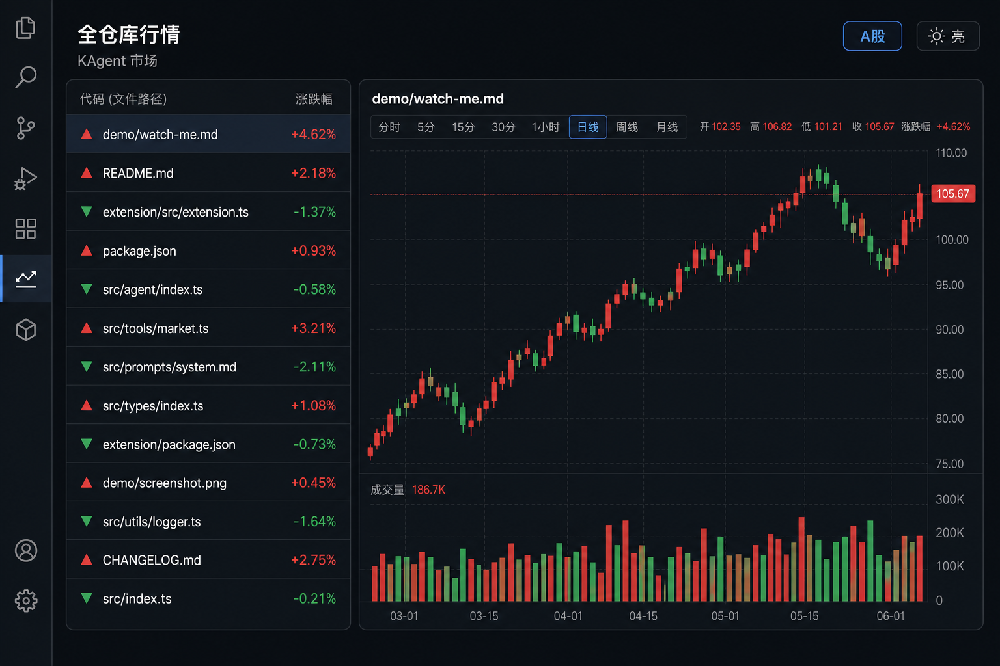
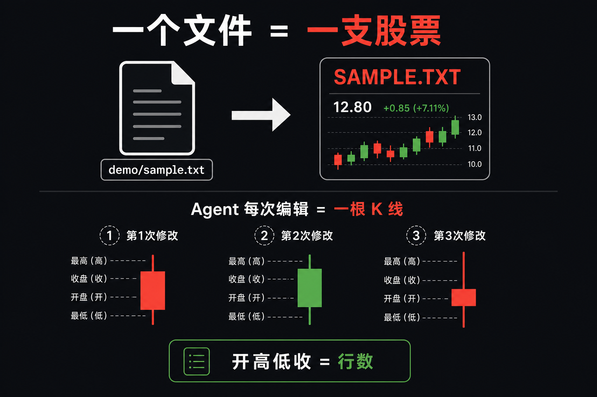
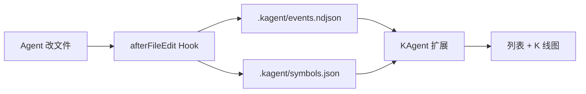

# KAgent

<p align="center">
  <strong>把 Cursor Agent 的每次改文件，画成一支「股票」的 K 线</strong><br/>
  <sub>一个文件 = 一支股票 · 首次被改 = 上市 · 每次编辑 = 一根 K 线</sub>
</p>

<p align="center">
  
</p>

> **30 秒记住三件事**  
> ① 安装 `.vsix` 扩展 → ② 在项目根执行 **「KAgent: 安装项目 Hooks」** → ③ 点活动栏 **KAgent** 看行情  
> 工作区必须是 **受信任（Trusted）**，Hooks 才会采集数据。

---

## 三步上手

### ① 安装扩展

在 `extension` 目录打包（首次或改代码后）：

```powershell
cd extension
npm install
npm run compile
npm run package
```

产物：`extension/kagent-0.1.2.vsix`（版本号以 `extension/package.json` 为准）。

**任选一种方式安装到 Cursor：**

| 方式 | 操作 |
|------|------|
| **命令行（推荐）** | `cursor --install-extension "G:\path\to\KAgent\extension\kagent-0.1.2.vsix"` |
| **命令面板** | `Ctrl+Shift+P` → 输入 `从 VSIX 安装` → **Extensions: Install from VSIX...** → 选 `.vsix` |
| **拖放** | 把 `.vsix` 拖到左侧 **扩展** 面板（Remote-SSH 等环境可能无效） |

安装后 **重新加载窗口**。若终端找不到 `cursor`：命令面板搜索 **Install 'cursor' command in PATH** 并执行，再重开终端。

<details>
<summary><strong>Windows：npm install 报 cp 不存在</strong></summary>

`postinstall` 在 Windows 上可能失败，手动复制图表库后再打包：

```powershell
Copy-Item node_modules\lightweight-charts\dist\lightweight-charts.standalone.production.js media\lightweight-charts.js
```

</details>

<details>
<summary><strong>开发调试（改扩展代码时）</strong></summary>

用 Cursor 打开 `extension` 文件夹 → **F5**（Run Extension）→ 在 Extension Development Host 中打开**同一项目根目录**。

</details>

---

### ② 安装项目 Hooks

1. 用 Cursor **打开仓库根目录**（不是只打开 `extension` 子文件夹）
2. `Ctrl+Shift+P` → **`KAgent: 安装项目 Hooks`**

成功后应有：

```
.cursor/hooks.json
.cursor/hooks/kagent-capture.mjs
.kagent/                 # 运行时数据，安装时会尝试写入 .gitignore
```

本仓库已自带示例 Hooks；**克隆即用**可跳过。换电脑或在新项目里使用 KAgent 时，请再执行一次该命令。

---

### ③ 看行情

| 入口 | 说明 |
|------|------|
| 活动栏 **KAgent** 图标 | 侧边栏 **全仓库行情** |
| `KAgent: 打开行情图` | 同上 |
| `KAgent: 刷新行情` | 视图标题栏刷新 |

- **左侧列表**：每个被 Agent 改过的文件 = 一支股票；**▲/▼** = 上一次修改涨跌  
- **右侧图表**：选中文件的 K 线；点列表项会在编辑器打开该文件  
- **右上角**：切换 **A股 / 美股**、**亮 / 暗**（或设置 `kagent.colorScheme`、`kagent.colorTone`）

Agent 每改一个新文件，列表里会多一支「新上市」的股票。

---

## 这是什么？

<p align="center">
  
</p>

| 现实世界 | KAgent |
|----------|--------|
| 一支股票 | 工作区里的 **一个文件** |
| 上市 | Agent **第一次**修改该文件 |
| 一根 K 线 | Agent **一轮**编辑（行数开高低收 + 成交量） |
| 红 / 绿 | **行数**变多或变少（A股红涨绿跌 / 美股相反，可切换） |

**能做什么**

- 自动采集： [Cursor Hooks](https://cursor.com/docs/hooks) `afterFileEdit` → `.kagent/`
- 侧边栏行情：列表 + K 线 + 成交量，**离线**内置图表，无需联网
- 同轮删增会拆成两根 K 线；行数不变但内容被改写也会记入（语义波动）

---

## 30 秒本地演示

不启动 Agent，用脚本模拟编辑：

```bash
node scripts/simulate-edit.mjs demo/sample.txt 3
node scripts/simulate-edit.mjs demo/sample.txt 1
```

打开侧边栏，选中 `demo/sample.txt`。完整剧本见 [`demo/watch-me.md`](demo/watch-me.md)。

---

## 常见问题

| 现象 | 处理 |
|------|------|
| 扩展面板没有「从 VSIX 安装」菜单 | 正常。用 **命令面板** 或 **`cursor --install-extension`**（见上文 ①） |
| 侧边栏一直是空的 | 确认已 **安装 Hooks**、工作区 **Trusted**、且用 **Agent 改过文件**（或跑上面的模拟脚本） |
| Hooks 不触发 | 必须打开**仓库根目录**；检查 `.cursor/hooks.json` 是否存在 |
| `cursor` 命令找不到 | 在 Cursor 里安装 Shell 命令到 PATH，重启终端 |

---

## 架构与数据



| 路径 | 作用 |
|------|------|
| `.kagent/events.ndjson` | 每次编辑一条事件 |
| `.kagent/symbols.json` | 已「上市」文件列表 |
| `.kagent/config.json` | 忽略路径（默认排除 `node_modules` 等） |

<details>
<summary><strong>K 线字段（进阶）</strong></summary>

| 字段 | 含义 |
|------|------|
| Open / Close | 该根 K 线起止 **行数** |
| High / Low | 该阶段最高 / 最低行数 |
| Volume | 删除或增加的行数 |
| 同轮拆分 | 同一次修改既有删又有增：先「删」K 线，再「增」K 线 |
| 颜色 | 收 ≥ 开为阳；A 股红阳绿阴，美股绿阳红阴 |

</details>

---

## 开发者

```bash
cd extension
npm install && npm run compile   # 日常开发可用 npm run watch
npm run package                  # 产出 kagent-x.y.z.vsix
```

| 资源 | 路径 |
|------|------|
| 界面示意 | [`docs/images/preview-sidebar.png`](docs/images/preview-sidebar.png) |
| 概念示意 | [`docs/images/concept.png`](docs/images/concept.png) |
| 演示说明 | [`demo/watch-me.md`](demo/watch-me.md) |

---

## 许可证

MIT
