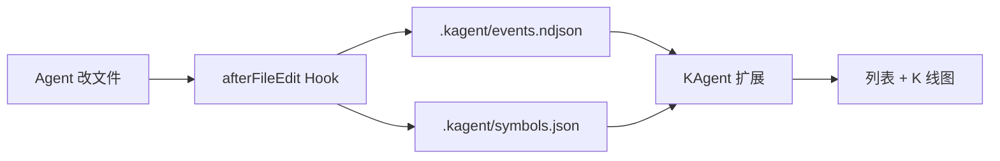

# KAgent

[中文](README.md) · [English](README.en.md)

**把 Cursor Agent 的每次改文件，画成一支「股票」的 K 线**  
一个文件 = 一支股票 · 首次被改 = 上市 · 每次编辑 = 一根 K 线


> 工作区须为 **受信任（Trusted）**，Hooks 才会采集数据。

---

## 三步上手

### ① 安装扩展

任选一种方式：

#### 从 Open VSX 安装

在 [Open VSX 扩展页](https://open-vsx.org/extension/JStone/kagent) 点击安装，或命令行：

```bash
codium --install-extension JStone.kagent
# 部分环境使用：
code --install-extension JStone.kagent
```


#### 从 VSIX 安装

1. 打开 [GitHub Releases](https://github.com/JStone2934/KAgent/releases)，下载 `kagent-x.y.z.vsix`；或本地打包（见 [从源码打包](#从源码打包)）。
2. 任选安装方式：


| 方式          | 操作                                                                 |
| ----------- | ------------------------------------------------------------------ |
| **命令行（推荐）** | `cursor --install-extension "路径/kagent-0.1.5.vsix"`                |
| **命令面板**    | `Ctrl+Shift+P` → **Extensions: Install from VSIX...** → 选择 `.vsix` |
| **拖放**      | 将 `.vsix` 拖到 **扩展** 面板（Remote-SSH 等环境可能无效）                         |


安装后 **重新加载窗口**。终端找不到 `cursor` 时：命令面板执行 **Install 'cursor' command in PATH**，再重开终端。

#### 从源码打包

```powershell
cd extension
npm install
npm run compile
npm run package
```

产物：`extension/kagent-x.y.z.vsix`。

**Windows：** `npm install` 报 `cp` 不存在

`postinstall` 在 Windows 上可能失败，手动复制图表库后再编译/打包：

```powershell
Copy-Item -Force node_modules\lightweight-charts\dist\lightweight-charts.standalone.production.js media\lightweight-charts.js
```


**开发调试（改扩展代码时）**

用 Cursor / VS Code 打开**仓库根目录** → **F5**（Run KAgent Extension）→ 在 Extension Development Host 中同样打开**仓库根目录**。根目录已提供 `.vscode/launch.json`；若只打开 `extension` 子文件夹，请用其内的 `extension/.vscode/launch.json`。


---

### ② 安装项目 Hooks

1. 用 Cursor **打开仓库根目录**
2. `Ctrl+Shift+P` → **`KAgent: 安装项目 Hooks`**

成功后应有：

```
.cursor/hooks.json
.cursor/hooks/kagent-capture.mjs
.kagent/                 # 运行时数据；安装时会尝试写入 .gitignore
```

本仓库已自带示例 Hooks，**克隆即用**可跳过。换电脑或在新项目里使用 KAgent 时，请再执行一次该命令。

---

### ③ 看行情


| 入口                | 说明            |
| ----------------- | ------------- |
| 活动栏 **KAgent** 图标 | 侧边栏 **全仓库行情** |
| `KAgent: 打开行情图`   | 同上            |
| `KAgent: 刷新行情`    | 视图标题栏刷新       |


- **左侧列表**：每个被跟踪的文件 = 一支股票；**▲/▼** = 相对上一根 K 线的涨跌；**新** / **改** = 刚上市或刚编辑  
- **右侧图表**：选中文件的 K 线；点列表项在编辑器打开该文件（已删除的不会弹错）  
- **右上角**：切换 **A 股 / 美股**、**亮 / 暗**（或设置 `kagent.colorScheme`、`kagent.colorTone`）
- **ST 退市**：在资源管理器中**手动删除**已跟踪文件后，列表项变灰并标 **ST退市**；再点 **刷新行情** 约 3 次后从列表移除（历史 K 线仍保留在 `events.ndjson`）

Agent 每改一个新文件，列表里会多一支「新上市」的股票。保存文件时若开启 `kagent.capture.onSave`，手动保存也会记一根 K 线。

---

## 这是什么？


| 现实世界   | KAgent                          |
| ------ | ------------------------------- |
| 一支股票   | 工作区里的 **一个文件**                  |
| 上市     | **第一次**被记录到该文件（Agent 或保存采集）   |
| 一根 K 线 | **一轮**编辑（行数开高低收 + 成交量）         |
| ST 退市  | **手动删除**已跟踪的源文件；灰色显示，多轮刷新后下市 |
| 红 / 绿  | **行数**变多或变少（A 股红涨绿跌 / 美股相反，可切换） |


**能做什么**

- **自动采集**：[Cursor Hooks](https://cursor.com/docs/hooks) `afterFileEdit`；可选 **保存时采集**（`kagent.capture.onSave`）→ 写入 `.kagent/`
- **侧边栏行情**：文件列表 + K 线 + 成交量，**离线**内置图表，无需联网
- **细粒度 K 线**：同轮既有删又有增会拆成两根；行数不变但内容被改写也会记入（语义波动）

---

## 30 秒本地演示

无需启动 Agent，用脚本模拟编辑：

```bash
node scripts/simulate-edit.mjs demo/sample.txt 3
node scripts/simulate-edit.mjs demo/sample.txt 1
```

打开 KAgent 侧边栏，选中 `demo/sample.txt`。完整剧本见 [demo/watch-me.md](demo/watch-me.md)。

---

## 常见问题


| 现象                  | 处理                                                                                                        |
| ------------------- | --------------------------------------------------------------------------------------------------------- |
| Cursor 里搜不到 KAgent  | Cursor 不走 Open VSX，请用 [VSIX](#从-vsix-安装) 或 [Releases](https://github.com/JStone2934/KAgent/releases) |
| 扩展面板没有「从 VSIX 安装」菜单 | 用 **命令面板** 或 **`cursor --install-extension`** |
| 侧边栏一直是空的            | 确认已 **安装 Hooks** 或开启 **保存采集**、工作区 **Trusted**、且 **改过/保存过文件**（或跑模拟脚本）                              |
| 删文件后没有 ST 退市        | 安装 **≥ 0.1.5** 并 Reload Window；在行情视图点 **刷新行情**；仅对已出现在列表中的文件生效                                      |
| Hooks 不触发           | 必须打开**仓库根目录**；检查 `.cursor/hooks.json` 是否存在                                                                |
| `cursor` 命令找不到      | 在 Cursor 中安装 Shell 命令到 PATH，重启终端                                                                          |


---

## 架构与数据




| 路径                      | 作用                          |
| ----------------------- | --------------------------- |
| `.kagent/events.ndjson` | 每次编辑一条事件（NDJSON）            |
| `.kagent/symbols.json`  | 已「上市」文件列表（含 `delisted` / `delist_rounds` 退市状态） |
| `.kagent/config.json`   | 忽略路径（默认排除 `node_modules` 等） |


**K 线字段（进阶）**


| 字段           | 含义                          |
| ------------ | --------------------------- |
| Open / Close | 该根 K 线起止 **行数**             |
| High / Low   | 该阶段最高 / 最低行数                |
| Volume       | 删除或增加的行数                    |
| 同轮拆分         | 同一次修改既有删又有增：先「删」K 线，再「增」K 线 |
| 颜色           | 收 ≥ 开为阳；A 股红阳绿阴，美股绿阳红阴      |


---

## 开发者

### 本地构建

```bash
cd extension
npm install && npm run compile   # 日常开发：npm run watch
npm run package                  # 产出 kagent-x.y.z.vsix
```


| 资源   | 路径                                                                   |
| ---- | -------------------------------------------------------------------- |
| 界面示意 | [docs/images/preview-sidebar.png](docs/images/preview-sidebar.png) |
| 概念示意 | [docs/images/concept.png](docs/images/concept.png) |
| 演示说明 | [demo/watch-me.md](demo/watch-me.md) |


### 发布 Release（维护者）

| Workflow | 作用 |
|----------|------|
| [CI](.github/workflows/ci.yml) | `main` / PR 变更 `extension/` 时自动编译并打包 VSIX（产物为 Artifact） |
| [Release](.github/workflows/release.yml) | 手动发版：递增版本 → Open VSX → 推送 tag → [GitHub Release](https://github.com/JStone2934/KAgent/releases) 附带 `.vsix` |

**一次性配置**

1. [open-vsx.org](https://open-vsx.org/user-settings/tokens) 创建 Access Token（namespace **JStone** 须已存在）。
2. 仓库 **Settings → Secrets → Actions** 添加 **OVSX_PAT**。

**发版步骤**

1. **Actions → Release → Run workflow**
2. 选择 `patch` / `minor` / `major`
3. 是否勾选 **Publish to Open VSX**（仅需 GitHub Release 时可取消）
4. 完成后在 [Releases](https://github.com/JStone2934/KAgent/releases) 下载 VSIX，Open VSX 同步更新

本地手动发布（勿在命令行明文粘贴 token）：

```powershell
cd extension
$env:OVSX_PAT = "<your-token>"
npm run package
npx ovsx publish kagent-x.y.z.vsix --no-dependencies -p $env:OVSX_PAT
```

---

## 许可证

[MIT](LICENSE)